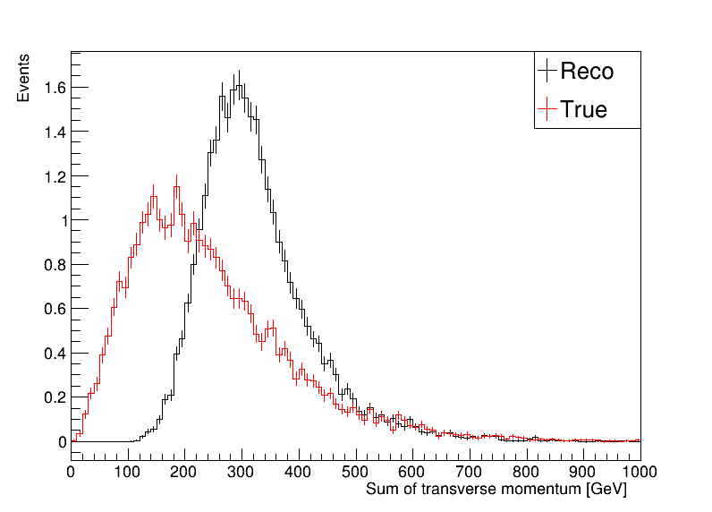
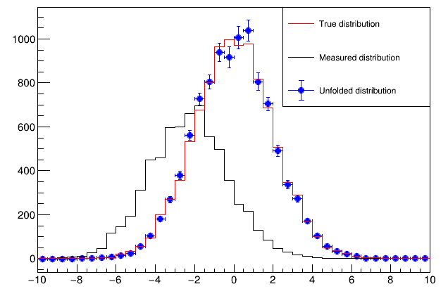
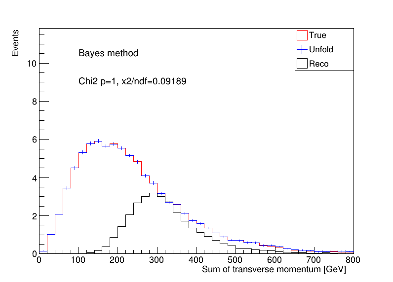
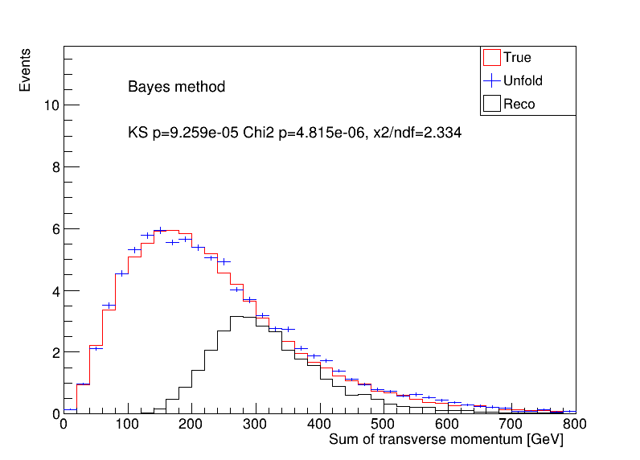
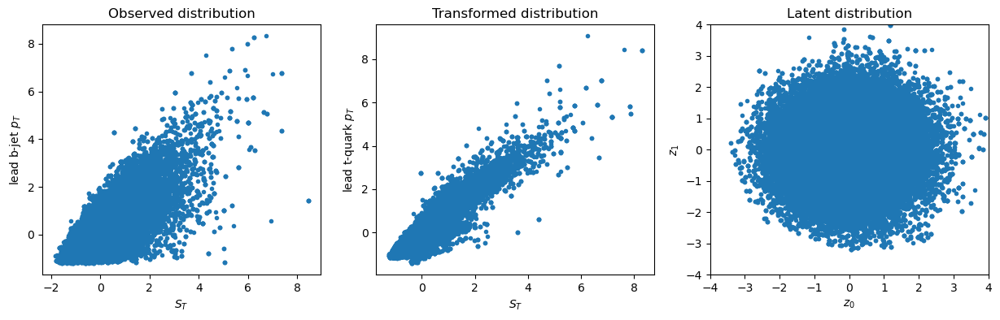
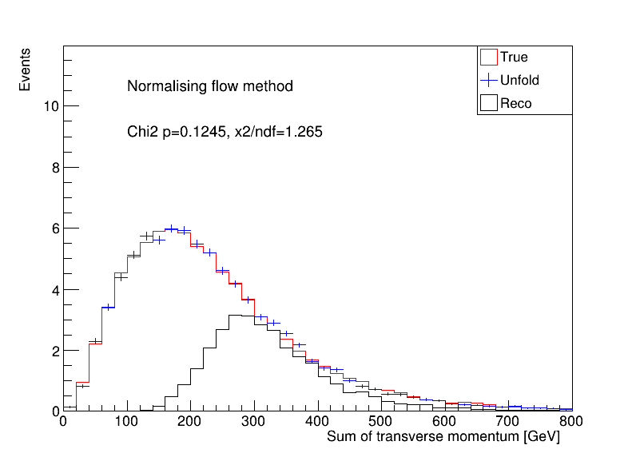
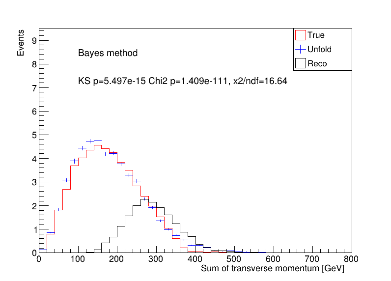
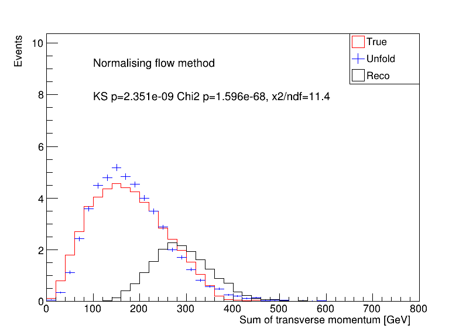
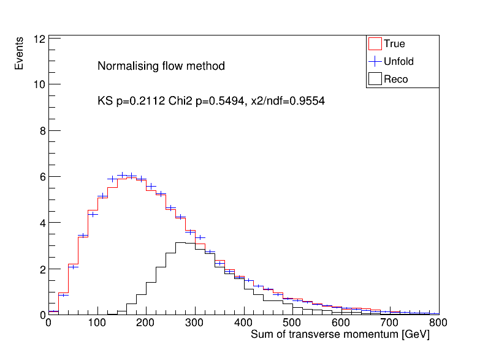

# TUFA

## Overview

[](https://root.cern.ch/)
[](https://github.com/peppapiggyme/ttbar-unfolding)
[](https://github.com/peppapiggyme/ttbar-unfolding/actions/workflows/cmake.yml)

Collection of works on unfolding practices using $t\bar{t}$ NLO samples.

* `Author`: Bowen Zhang
* `Data`: 22/10/2023
* `Version`: 1.2
* `Workspace`: Artlas:~/Documents/projects/ttbar-unfolding/

> See also <https://trello.com/c/UBuyDELV>

## Samples

**[MG5PY8 $t\bar{t}$ samples]** The matrix elements are generated by `MadGraph5 aMC@NLO`, $t\bar{t}$ decays to $bW^{+}\bar{b}bW^{-}$ to $b\mu^{+}\nu_{\mu}\bar{b}b\mu^{-}\bar{\nu}_{\mu}$ using `MadSpin`. The samples are showered by `Pythia8`. The output Hepmc file is reconstructed by fast detector simulation tool `Delphes`.

## Structure

* `RooUnfold` (external): Roofit extension. Interface to common unfolding methods implemented in ROOT.
* `ttbar_MadTree`: Tool to analysis the MG5PY8 $t\bar{t}$ samples. Fill trees and histograms.
* `ttbar_Unfold`: Application of RooUnfold with kinematic distributions produced by ttbar_MadTree.
* `FlowModel`: Contains testing code of using the normalising flow model for ttbar unfolding.
* ...

## Details

### Sample generation

* Madgraph aMC@NLO + Pythia8 + MadSpin + Delphes
* Artlas: ~/Documents/playground/ttbar_nlo/
* Pre-selection ttbar_nlo_decayed

| Split | Status | Size | File |
| --    | --     | --   | --   |
| Train |  | 100k | ttbar_nlo_ATLAS_PileUp.root      |
| Test  |  | 100k | ttbar_nlo_ATLAS_PileUp_Test.root |

 100k for training , 100k for testing

### MadTree analysis

* Truth: Find two original top-quark (by status == 62). Set them as true top-quarks.

```c++
if (tree->Particle_Status[i] == 62) {
    if (tree->Particle_PID[i] == 6) {
        t[0] = i;
        ++count;
    } else if (tree->Particle_PID[i] == -6) {
        t[1] = i;
        ++count;
    }
}
```

* Reco: (bbmumu) Find two b-jets (efficiency is quite low..). Find two muons (leading two..)
* Targetting kinematics: sum of transverse momentum (true and reconstructed $p_{\text{T}}^{t\bar{t}}$)
>
> Looks like the opposite of unfolding: inverse smearing..
>
> 
>
* Fill/Miss response in ttbar_MadTree
* Output: reco_analysis__ttbar_nlo_ATLAS_PileUp(_Test).root
* Produce ROOT tree. Might be utilised by advanced methods.

```
root [1] nominal->Show(1)
======> EVENT:1
t0_truth_Pt     = 166.36
t1_truth_Pt     = 207.932
tt_truth_Pt     = 44.5957
tt_truth_m      = 513.26
ST_truth        = 374.292
tt_Pt           = 155.199
tt_m            = 284.667
ST              = 464.953
mu0_Pt          = 49.5792
mu1_Pt          = 10.8683
b0_Pt           = 150.474
b1_Pt           = 72.6333
MET             = 181.398
n_jets          = 7
event_number    = 2
weight          = 0.00154058
```

### Unfolding

* Tutorial: follow this [RooUnfold tutorial](https://statisticalmethods.web.cern.ch/StatisticalMethods/unfolding/RooUnfold_01-Methods/).



* Other reference: [TUnfold](https://root.cern.ch/doc/master/classTUnfold.html) | [TSVDUnfold](https://root.cern/doc/v628/classTSVDUnfold.html) | [TUnfold tutorial](https://root.cern.ch/doc/master/group__tutorial__unfold.html) | [RooUnfold](https://gitlab.cern.ch/RooUnfold/RooUnfold)

* Traditional method: choose SVD method

  * First try: Naive 100 bin, the testing performance is very poor!
  * Impact of binnings (less bin makes results significantly better for kBayes method, not for kSVD method), fill/miss (not really).
  * Second try: 40 bins from 0 to 800 GeV, kBayes method performs decent!





* Normalising flow unfolding

  * First try: two 2-D RealNVP models, from gaussian to (ST, b0_Pt), and from gaussian to (ST_truth, t0_truth_Pt), encoder/decoder
  * Only use events with positive weights in training (for stability). Result looks reasonable ..
  * Be cautious with weights, including them does not garentee better performance. It depends on the distribution of weights ..
  * The current models are probably under-trained!
  
  ```text
  Reco  : 39000 /  40000, train_loss=1.917694, val_loss=1.921390, lr = 0.000125
  Truth : 39000 /  40000, train_loss=1.034327, val_loss=1.032731, lr = 0.000125
  ```





* Performance metric

  * Test of similarity: $\chi^2$-test between truth and unfolding histograms. Results are shown inside the plots.

* Optimisation & Tests

  * Further improvements on the normalising flow method
  * Test the performance on selected sample:
  Apply cut on true $t\bar{t}$ invariant mass.
  
  ```cpp
  APPLY_CUT(m_event.Get(Index::tt_truth_m) < 500 && m_event.Get(Index::tt_truth_m) > 200);
  ```

  Traditional method:
  

  Normalising flow method:
  

  Both bad performance. Normalising flow can be improved by training encoder-decoder in one model (see Discussion).

### Discussion

* The traditional unfolding method can only unfold one variable at a time.
However, the NN method can unfold all variable at once, e.g. [OmniFold](https://arxiv.org/abs/1911.09107).
* RealNVP method takes even number of features in the input. 2-D is tested, more variable might help to improve further.
It's better to have uncorrelated features.
* In the RealNVP method, the weights of the generated unfolding sample need investigation.
* The decoder-only inference can also generate target distribution, the perf with be consistent with the encoder-decoder case if an inclusive set is used for testing.

> In fact, it might reach better perf because the loss of decoder is smaller.

The encoder-decoder is meant to be used in an exclusive set (after selections). To achieve best perf, there are possible improvements:

1) train encoder-decoder in one model e.g. [VAE](https://github.com/VincentStimper/normalizing-flows/blob/v1.7.2/normflows/core.py#L656).
But the events must have true and reco information correspondingly.
If they have to be trained separately, the latent space are not connected. Maybe apply additional layer between the two different latent normal distributed spaces (?).

2) train conditional normalising flow model e.g. [Conditional](https://github.com/VincentStimper/normalizing-flows/blob/v1.7.2/normflows/core.py#L216)



## Conclusion

In this specific instance, the utilization of the RealNVP model has proven to outperform the conventional unfolding method in generating a more accurate distribution of $S_T$ from the reco distribution.
It's worth noting that this may not represent a universal solution for all real analysis scenarios.
The full spectrum of possibilities offered by normalizing flow models remains largely unexplored.

It's imperative to emphasize that the choice of which model to employ should be closely aligned with the specific nuances of the problem at hand.
A prudent approach involves a comparative assessment, applying both the traditional and the novel methods, in order to determine the more suitable and effective solution for the real-world problem at play.
