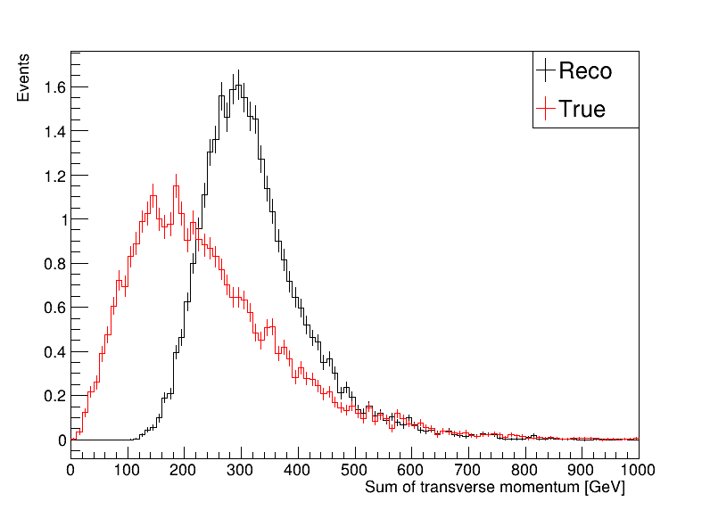
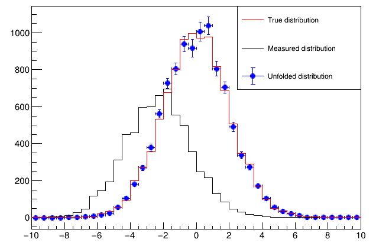
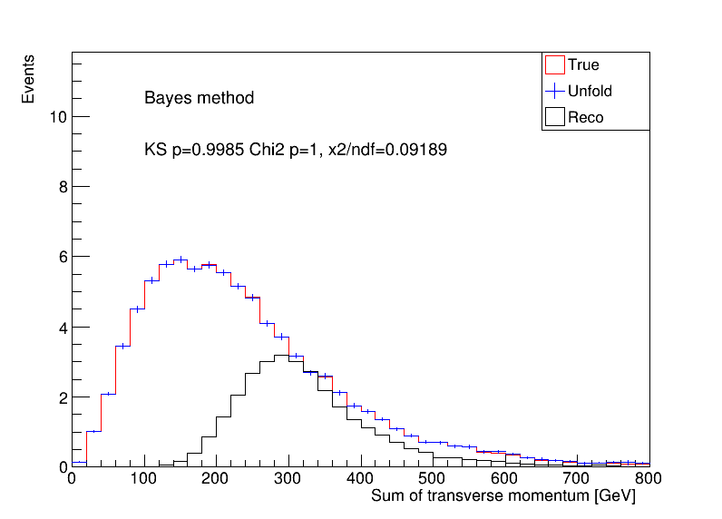
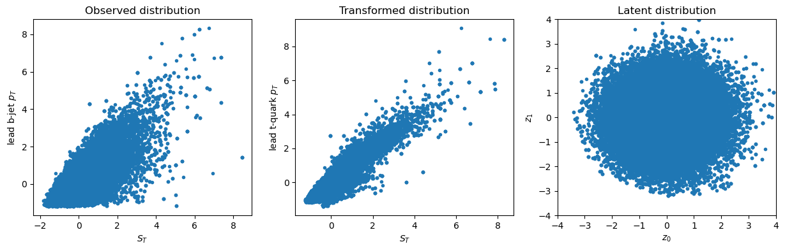
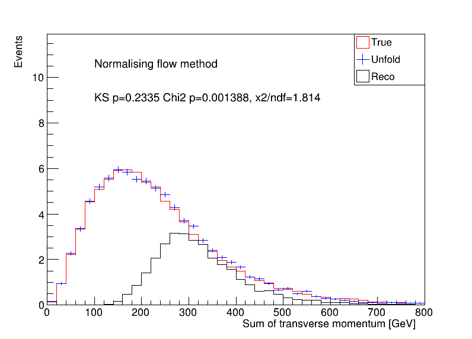
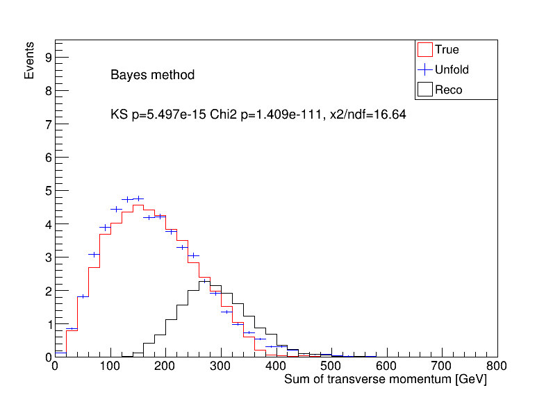
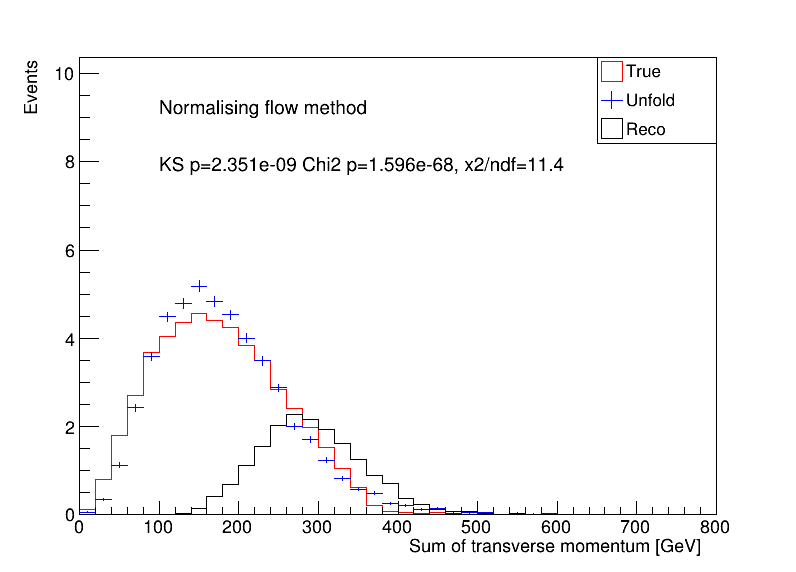

### Sample generation

* Madgraph aMC@NLO + Pythia8 + MadSpin + Delphes
* Path: ~/Documents/playground/ttbar_nlo/
* Pre-selection ttbar_nlo_decayed

| Split | Status | Size | File |
| --    | --     | --   | --   |
| Train |  | 100k | ttbar_nlo_ATLAS_PileUp.root      |
| Test  |  | 100k | ttbar_nlo_ATLAS_PileUp_Test.root |

100k for training , 100k for testing

### MadTree analysis

* Truth: Find two original top-quark (by status == 62). Set them as true top-quarks.

```c++
if (tree->Particle_Status[i] == 62) {
    if (tree->Particle_PID[i] == 6) {
        t[0] = i;
        ++count;
    } else if (tree->Particle_PID[i] == -6) {
        t[1] = i;
        ++count;
    }
}
```

* Reco: (bbmumu) Find two b-jets (efficiency is quite low..). Find two muons (leading two..)
* Targetting kinematics: sum of transverse momentum (true and reconstructed $p_{\text{T}}^{t\bar{t}}$)



* Fill/Miss response in ttbar_MadTree
* Output: reco_analysis__ttbar_nlo_ATLAS_PileUp(_Test).root

```
root [1] nominal->Show(1)
======> EVENT:1
t0_truth_Pt     = 166.36
t1_truth_Pt     = 207.932
tt_truth_Pt     = 44.5957
tt_truth_m      = 513.26
ST_truth        = 374.292
tt_Pt           = 155.199
tt_m            = 284.667
ST              = 464.953
mu0_Pt          = 49.5792
mu1_Pt          = 10.8683
b0_Pt           = 150.474
b1_Pt           = 72.6333
MET             = 181.398
n_jets          = 7
event_number    = 2
weight          = 0.00154058
```

### Unfolding

* Tutorial: follow this [RooUnfold tutorial](https://statisticalmethods.web.cern.ch/StatisticalMethods/unfolding/RooUnfold_01-Methods/).



* Other reference: [TUnfold](https://root.cern.ch/doc/master/classTUnfold.html) | [TSVDUnfold](https://root.cern/doc/v628/classTSVDUnfold.html) | [TUnfold tutorial](https://root.cern.ch/doc/master/group__tutorial__unfold.html) | [RooUnfold](https://gitlab.cern.ch/RooUnfold/RooUnfold)

* Traditional method (Bayes)

  * First attempt: Initially, a naive approach was employed with 100 bins, which, unfortunately, proved to be unsuccessful in achieving the desired results.
  * Binning Analysis: Subsequent investigations revealed the critical role of binning strategies. Notably, using fewer bins yielded notably improved results with the kBayes method, although the same was not true for the kSVD method. Additionally, the influence of filling / missing was explored, with limited impact observed.
  * Second Attempt: Building upon the insights gained, a more refined strategy was adopted, involving the use of 40 bins spanning the energy range of 0 to 800 GeV. With this revised approach, the kBayes method exhibited decent performance, marking a significant improvement over the initial attempt.




* Normalising flow method (RealNVP)

  * Initial Attempt: Two 2-D RealNVP models. The first model mapped from a Gaussian distribution to the variables (ST, b0_Pt), while the second model mapped from a Gaussian distribution to (ST_truth, t0_truth_Pt). They serve as encoder and decoder, respectively.
  * Limiting the use of events with positive weights to enhance stability.
  * Weighted Data Caution: Notably, the incorporation of event weights into the training process did not consistently guarantee improved performance. The impact of weights on model efficacy depended on the specific weight distribution.
  * Training: The current models may be undertrained, implying that there may be untapped potential for performance improvement with further training and fine-tuning.
  
  ```text
  Reco  : 39000 /  40000, train_loss=1.917694, val_loss=1.921390, lr = 0.000125
  Truth : 39000 /  40000, train_loss=1.034327, val_loss=1.032731, lr = 0.000125
  ```





* Performance metrics

  * To assess the effectiveness of the unfolding process, two key similarity tests were conducted: the Kolmogorov-Smirnov (KS) test and the $\chi^2$-test. These tests were applied to compare the distributions of the unfolded data with the ground truth, and the results are visually depicted within the respective plots.

* Optimisation & Tests

  * Further enhancing the performance of the normalizing flow method (?).
  * Selective Sample Testing: A specific sample was selected by applying a cut on the true $t\bar{t}$ invariant mass using the provided C++ code snippet:
  
  ```cpp
  APPLY_CUT(m_event.Get(Index::tt_truth_m) < 500 && m_event.Get(Index::tt_truth_m) > 200);
  ```

  It is evident that both methods exhibited suboptimal performance in this specific scenario.
  Notably, the normalizing flow approach shows potential for improvement, particularly through the training of an encoder-decoder architecture as discussed.

Traditional method:



Normalising flow method:



### Discussion

* The traditional unfolding method is constrained to unfolding one variable at a time. However, the neural network (NN) method offers the capability to simultaneously unfold multiple variables, as demonstrated by methods like [OmniFold](https://arxiv.org/abs/1911.09107).
* The RealNVP method requires an even number of features in the input. Initial tests were conducted with 2-D data, but it's worth exploring the potential benefits of including more variables to further enhance performance. Notably, incorporating correlated features can potentially contribute to improved results (?)
* An important investigation within the RealNVP method is the MC weights assigned to the generated events.
* It's important to note that the decoder-only inference has the capacity to generate the target distribution. Better performance may be expected due to the smaller loss of the decoder.


* Further steps to understand the encoder-decoder model.
  
  * Train the encoder and decoder in a single model e.g. [VAE](https://github.com/VincentStimper/normalizing-flows/blob/v1.7.2/normflows/core.py#L656). This approach requires that events have both true and reco information available correspondingly.

  * If separate training is necessary, consider strategies to connect the two distinct latent normal distributed spaces, which may involve adding an additional layer. (e.g. another simple normflow, gaussian to gaussian).

  * Explore the potential of training a conditional normalizing flow model e.g. [Conditional](https://github.com/VincentStimper/normalizing-flows/blob/v1.7.2/normflows/core.py#L216).
